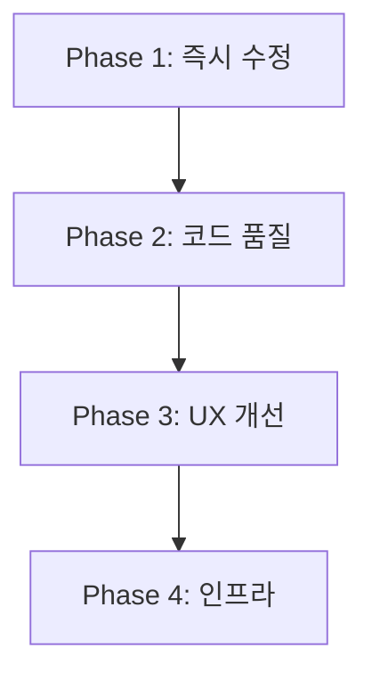

# BeautyHub 앱 점검 및 개선 계획

## 점검 결과 요약 (2025-03-13)

### 정상 동작
- **빌드**: `npm run build` 성공 (exit code 0)
- **타입 검사**: 통과
- **주요 페이지**: 45개 라우트 정상 생성

### 발견된 이슈

#### 1. next.config.js 리다이렉트 충돌
- `/analytics` 및 `/analytics/:path*`가 `/dashboard`로 리다이렉트됨
- `app/analytics/page.tsx` 페이지가 존재하나 직접 접근 불가
- **권장**: 리다이렉트 제거 또는 Sidebar에 분석 메뉴 추가 후 리다이렉트 제거

#### 2. 빌드 시 API 정적 렌더링 경고
- `cookies` 사용으로 인해 다음 API가 정적으로 렌더링되지 않음 (정상 동작):
  - `/api/inventory/transactions`
  - `/api/appointments/reminders`
  - `/api/customers/inactive`
  - `/api/analytics/vip-customers`
- 런타임에서는 정상 동작

#### 3. ESLint 경고 (ignoreDuringBuilds: true로 빌드 시 스킵됨)
- `@typescript-eslint/no-explicit-any`: 20+ 건 (AppointmentsCalendar, dashboard, Button, Card 등)
- `react-hooks/exhaustive-deps`: TopBar, ReservationDetailModal, useInventoryData

#### 4. products/page.tsx load 함수
- `load`의 catch에서 `getLocalizedErrorMessage` 미적용 (109행)
- `에러가 발생했습니다.` 하드코딩

---

## 개선 계획

### Phase 1: 즉시 수정 (우선순위 높음)

| 항목 | 파일 | 수정 내용 |
|------|------|-----------|
| analytics 접근 | next.config.js | `/analytics` 리다이렉트 제거 또는 Sidebar에 분석 메뉴 추가 |
| products load 에러 | products/page.tsx | catch 시 `getLocalizedErrorMessage(e)` 적용 |

### Phase 2: 코드 품질

| 항목 | 대상 | 수정 내용 |
|------|------|-----------|
| any 타입 제거 | dashboard/page.tsx, AppointmentsCalendar 등 | 구체적 타입 정의 |
| useEffect 의존성 | TopBar, ReservationDetailModal, useInventoryData | toast 등 누락 의존성 추가 |

### Phase 3: UX 개선 (기존 beautyhub_ux_개선 계획 참조)

- ErrorState 재시도 버튼 동작 검증
- 날짜/금액 포맷 통일
- 폼 필수 필드 표시
- 접근성 (aria-label, 터치 영역)

### Phase 4: 인프라

| 항목 | 내용 |
|------|------|
| ESLint | ignoreDuringBuilds 해제 후 경고 해결 |
| 테스트 | vitest 커버리지 확대 |

---

## 구현 순서

